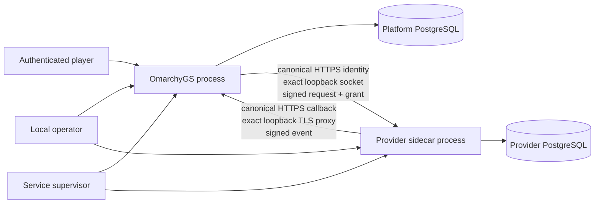

# Provider sidecar threat model

This document models the reviewed co-located deployment profile selected by
Ticket 046. Scenarios below are design hypotheses, not confirmed
vulnerabilities. The repository has no applicable `SECURITY.md`; the project
Constitution, provider architecture, and active EARS requirements therefore
define the binding security objectives. The architecture review was performed
sequentially because this workflow does not authorize a separate review agent;
it is not an independent assessment.

## Overview

OmarchyGS remains the platform authority. It authenticates players, admits one
exact registered provider release, issues pairwise scoped grants and signed
requests, enforces lifecycle and quotas, and stores only the session envelope
and authenticated public projections. A provider owns its rules and gameplay
state in a different process and PostgreSQL database. The schema makes these
authorities mutually exclusive: registered-provider sessions have no compiled
rules state (`migrations/0015_first_party_remote_provider_authority.sql:24`).

The remote profile resolves the release's immutable DNS endpoint and admits
only globally routable addresses. The sidecar profile instead maps one
operator-configured release UUID to one exact loopback socket. It still uses
the registered DNS host as HTTPS SNI and Host/signature authority, the
registered TLS roots and provider message keys, fixed operation paths, current
grants, quotas, deadlines, replay records, and lifecycle checks. Co-location
changes only destination resolution; it does not create a new protocol or
trust class (`docs/planning/pipeline/completed/reviewed-provider-sidecar-and-deployment-operations.spec.md:39`).

| Component | Authority and role | Source |
|---|---|---|
| Server provider runtime | Holds platform grant/message secrets and constructs the platform-only broker. | `crates/server/src/provider_games.rs:40` |
| Provider registry and broker | Pins release identity/policy, performs compatibility, issues grants, signs requests, verifies responses, records quotas/replay/audit. | `docs/operators/provider-security.md:14` |
| Guarded provider client | Builds a no-proxy, no-redirect, registered-root-only HTTPS client with finite deadlines and response bounds. | `crates/game-provider/src/egress.rs:83` |
| Provider starter | Exposes only four fixed TLS routes, authenticates Host/message/grant context, and owns a separate durable store/callback outbox. | `crates/provider-starter/src/runtime.rs:124` |
| Platform callback boundary | Accepts only the exact configured callback authority and release path before provider signature and projection checks. | `crates/server/src/provider_games.rs:620` |
| Platform PostgreSQL | Owns provider registration, lifecycle, grants, attempts, audit, session envelopes, bounded operation reservations, and authenticated projections; never provider rules state. | `migrations/0015_first_party_remote_provider_authority.sql:1`; `migrations/0029_provider_operation_reservations.sql:1` |
| Provider PostgreSQL | Owns provider sessions, operation receipts, consumed grants, and callback outbox through provider-only credentials. | `crates/provider-starter/src/runtime.rs:132` |
| Operator/supervisor | Supplies exact public registration plus separately held runtime secrets, service identities, writable paths, limits, backup, rotation, and incident actions. | `docs/operators/provider-security.md:52` |

### Effective resources

| Deployment or workflow | Resource or capability | Configuration and precedence | Safe effective value or location | Readers, writers, or recipients | Enforcing control | Evidence or unknowns |
|---|---|---|---|---|---|---|
| Remote broker request | Provider destination | Immutable registered endpoint and active TLS roots; DNS is resolved per guarded client | Canonical `https://<dns>:<port>/<base>/<operation>` pinned to validated public answers | OmarchyGS broker; registered provider | Endpoint validator, public-IP classifier, no proxy/redirect, registered roots, SNI/Host and message signatures | Current implementation: `crates/game-provider/src/model.rs:243`, `crates/game-provider/src/egress.rs:46` |
| Sidecar broker request | Provider destination | Optional exact sidecar release UUID/socket overrides DNS only for that matching registered release | One loopback IP and exact registered port; canonical DNS URL remains the TLS and signature identity | OmarchyGS broker; one co-located provider process | Exact release match, loopback/port checks, guarded HTTPS client, TLS/message identity, and broker controls | Implementation: `crates/game-provider/src/egress.rs`; hostile transport proof: `crates/game-provider/tests/starter_integration.rs` |
| Remote provider callback | Platform callback destination | Provider-owned exact URL and registered platform callback TLS root | Exact release callback path at the configured DNS authority | Provider callback worker; platform callback handler | HTTPS only, one root, no proxy/redirect, bounded timeout, signed event | Current client: `crates/provider-starter/src/callback.rs:27`; platform admission: `crates/server/src/provider_games.rs:620` |
| Sidecar provider callback | Platform callback destination | Explicit sidecar callback constructor maps the exact canonical URL to one loopback TLS reverse-proxy socket | One loopback IP and matching URL port; canonical DNS authority/path retained | Provider process; local TLS proxy; OmarchyGS handler | Domain/loopback/port checks, TLS and signed-event controls, no ambient proxy, and disabled reverse-proxy admin API | A loopback TLS proxy is a deployment prerequisite because the Axum server itself currently serves plain HTTP |
| Platform secrets | Grant seed, pairwise secret, message seed | All-or-none server environment or service credentials | Platform service credential store; never provider config/database | OmarchyGS process only | Exact base64url lengths and startup rejection | `crates/server/src/config.rs:134` |
| Provider secrets | Provider message seed, TLS private key, provider database credential | Provider-private configuration and service credentials | Provider-owned mode-0600 files/credential directory | Provider process only | Provider starter has no platform DB/admission handle; service-template containment remains required | `crates/provider-starter/src/runtime.rs:67` |
| Gameplay authority | Provider rules state vs platform envelope | Session authority discriminator and exact release pin | Provider DB for rules; platform DB for envelope/projection | Respective process/database roles | Database constraints forbid simultaneous compiled and provider state | `migrations/0015_first_party_remote_provider_authority.sql:24` |

## Threat model, trust boundaries, and assumptions

Protected assets are account/persona secrecy, platform authentication and
admission authority, grant/message signing secrets, provider message/TLS
private keys, each database's credentials and authoritative records, immutable
release/endpoint identity, exact replay semantics, session revision and public
projection integrity, lifecycle/audit evidence, and service availability.

The realistic attackers are: a remote network or DNS attacker; an
unauthenticated player; a malicious or compromised registered provider; and an
unprivileged local process that can connect to or race for a loopback port.
They do not initially control operator configuration, either service account,
registered private keys, the reverse proxy, or either database. An operator or
root compromise already has the authority to replace configuration and service
binaries and is therefore a deployment assumption, not a privilege gain
claimed by this model.

Important boundary crossings are:

- player to platform: ordinary account/persona and game authorization remains
  entirely inside OmarchyGS; no player connects directly to the provider;
- platform to provider: exact release identity, a pairwise game-scoped subject,
  a one-scope expiring grant, and signed bounded request bytes cross the
  boundary; provider/database credentials do not;
- provider to platform: signed bounded responses/events and public game facts
  cross back; account/persona IDs, reusable device credentials, and private
  provider state do not;
- operator to registry/service manager: the operator selects immutable release
  policy, one optional sidecar socket, keys, quotas, lifecycle, credentials,
  and executable paths; those values are privileged configuration;
- each process to its database: separate roles and databases must prevent a
  provider compromise from reading or mutating platform state and prevent the
  platform from adopting provider rules state.

Security objectives are:

1. A sidecar mapping applies only to its exact configured release and exact
   registered endpoint port; it never admits arbitrary loopback, private, link-
   local, or metadata destinations.
2. TLS hostname/root verification and signed request/response/grant/event
   context remain mandatory even when a local process owns the destination
   port.
3. Release, provider, scope, key, pilot, quota, deadline, replay, and audit
   decisions remain enforced from current platform state. Registration or SDK
   installation alone never activates a provider.
4. The platform and provider have separate users, processes, credentials,
   databases, writable paths, backups, and upgrades; neither receives a shared
   state or compiled fallback.
5. Provider outage or unknown outcome prevents further game mutation, preserves
   the last authenticated view as read-only, and recovers only through
   authenticated reconciliation. The platform serializes command and reconcile
   work with a durable, expiring, response-fenced reservation plus a
   process-held PostgreSQL advisory fence around provider transport. Expiry
   cannot reclaim work while its process fence is live; an abandoned
   reservation changes a ready session to `reconciling` before another command
   can reach the broker (`migrations/0029_provider_operation_reservations.sql:1`).
6. Logs, receipts, monitoring, and incident artifacts contain stable IDs and
   bounded dispositions, never secrets, grants, pairwise subjects, database
   URLs, or raw authenticated bodies.

Assumptions and exclusions:

- Linux/systemd and a local TLS reverse proxy are the documented co-located
  deployment; other supervisors must reproduce the same controls.
- Loopback prevents remote reachability but is not peer authentication. TLS,
  signed protocol context, exact port binding, and OS service isolation provide
  the authentication and containment.
- The operator validates binary provenance and owns host/root security,
  database administration, backup custody, monitoring, and incident response.
- Door Legends remains the sole production-admitted release. Relay Forge and
  all sidecar drills use ephemeral registration and databases.
- External provider review, hosted origins, DNS/account provisioning, package
  publication, support staffing, and a real observation window are outside
  this local model and remain open work.

## Attack surface, mitigations, and attacker stories

| Priority | Scenario and capability gain | Prerequisites | Impact | Existing controls | Mitigation | Evidence |
|---|---|---|---|---|---|---|
| P1 | A sidecar option behaves as a generic private-network resolver override, letting a registered endpoint reach an unrelated local service. | Attacker can influence release selection or under-bound sidecar config but not operator keys. | Provider request/grant disclosure or unintended local request sink. | Endpoint URL is canonical DNS-only and all paths are allowlisted. | Bind the mapping to one non-nil release UUID, exact loopback socket, matching registered port, and the registry's immutable endpoint; fall back to public egress for every other release. | Endpoint controls: `crates/game-provider/src/model.rs:260`; required hostile cases: active spec line 40. |
| P1 | A local process wins the configured port and impersonates the provider. | Unprivileged local process can bind the socket while the provider is down. | It can receive ciphertext/HTTP connection attempts and try to forge gameplay responses. | Client trusts only registered roots; response signatures bind provider/release/message/body; grants are short-lived and scoped. | Keep provider TLS and message private keys outside the socket-owning account, fail on wrong TLS or signed identity, supervise ordering, and alert on repeated handshake/authentication failure. | HTTPS controls: `crates/game-provider/src/egress.rs:83`; signed compatibility contract: `docs/operators/provider-security.md:37`. |
| P1 | A compromised provider process pivots into platform state or credentials because the two services share an OS user, config, or database role. | Provider code execution. | Account/persona disclosure, platform signing-key theft, admission mutation, or durable platform compromise. | Protocol exposes pairwise subjects only; starter accepts no platform database/admission handle. | Separate service users, credential directories, database/role ownership, writable paths and backups; deny non-loopback networking and unnecessary syscalls/capabilities; test template invariants. | Starter boundary: `crates/provider-starter/src/runtime.rs:67`; requirement: active spec line 41. |
| P1 | A forged or redirected callback mutates platform projections. | Attacker can reach the platform callback or influence provider callback configuration. | False result/achievement or session state. | Exact release path/authority, registered provider message key, body/context binding, lifecycle recheck, dedupe, no redirects. | Sidecar callback must retain the canonical DNS authority and exact path while overriding only one loopback socket; reject IP literals and port mismatches. | Callback admission: `crates/server/src/provider_games.rs:620`; current target validation: `crates/provider-starter/src/callback.rs:27`. |
| P1 | Provider crash or database loss causes later commands to mutate from stale state or triggers compiled fallback. | Service/DB outage during an operation. | Divergent revisions, duplicate effects, or split authority. | Durable platform/provider receipts, operation reservation plus live-process advisory fence, unknown-outcome handling, authority schema excludes compiled state, authenticated reconcile exists. | Admit only one command/reconcile at a time, deny expiry reclamation while the process fence is live, reject stale response projection, move an abandoned ready reservation to `reconciling`, restore provider DB independently, reconcile, and never reconstruct rules state from cached views. | Reservation: `migrations/0029_provider_operation_reservations.sql:1`; authority constraint: `migrations/0015_first_party_remote_provider_authority.sql:24`. |
| P2 | Partial or mismatched environment enables a sidecar for the wrong release/socket. | Operator mistake or configuration tampering. | Outage or unintended destination mapping. | Existing provider secrets are all-or-none. | Make the two sidecar values all-or-none, validate UUID/loopback/nonzero port at startup, and re-bind release plus registered endpoint port before each guarded client construction. | Existing config pattern: `crates/server/src/config.rs:134`. |
| P2 | A co-located provider exhausts CPU, memory, connections, request leases, or callback retries. | Buggy or malicious admitted provider. | Local denial of service. | Broker request/callback quotas, concurrent leases, finite body/connect/total limits; callback attempts are bounded. | Add supervisor CPU/memory/task/file limits, restart backoff, database connection caps, health/audit monitoring, and suspension thresholds. | Registered limits: `docs/operators/provider-security.md:22`; callback bound: `crates/provider-starter/src/callback.rs:14`. |
| P2 | Rotation or upgrade removes old verification material before in-flight/replayed evidence resolves. | Operator changes keys/binary/schema. | Recovery denial or incorrect replay handling. | Key rotation appends immutable windows and durable response preimages/receipts. | Use overlap, verify authenticated evidence under the new key, take separate backups, perform stop/start/reconcile drill, then suspend old keys; upgrades never change release identity in place. | Rotation procedure: `docs/operators/provider-security.md:32`. |
| P3 | Logs, environment dumps, or drill receipts expose credentials or pairwise subjects. | Debugging, monitoring, or incident collection. | Credential reuse or privacy loss. | Public errors and safe audit details exclude raw secrets/bodies. | Templates use service credentials, commands avoid secret echoing, receipts contain only stable counts/dispositions/digests, and tests scan outputs for forbidden fields. | Error/audit policy: `docs/operators/provider-security.md:120`. |

No story above is a reportable finding solely because it is plausible. Ticket
046 must implement the stated mitigations and close every cited verification
gap before the sidecar profile is called reviewed.

## Severity calibration (Critical, High, Medium, Low)

- **Critical:** a sidecar/provider can obtain platform signing secrets or
  arbitrary platform database/admin execution without prior operator/root
  authority. A provider mutating only its own rules state is not critical.
- **High:** an unauthenticated remote or local process can forge an accepted
  provider response/event, escape the exact release destination into a
  sensitive local service, or make OmarchyGS execute compiled fallback for a
  provider-owned session. Port possession without valid TLS/message keys is
  not high because it gains availability impact only.
- **Medium:** an admitted or local unprivileged process can reliably force
  cross-service denial of service, bypass a release/scope lifecycle decision,
  disclose pairwise subjects at scale, or cause stale/duplicate provider
  mutation under realistic prerequisites. A fail-closed configuration error
  with clear operator recovery is normally lower.
- **Low:** bounded self-only outage, confusing diagnostics, missing hardening
  that does not cross an enforced authority boundary, or a local port race that
  fails TLS/message authentication. Root/operator-controlled replacement of a
  configured provider is outside the attacker boundary rather than a low
  vulnerability.

Effective TLS, signed-message verification, exact release/socket binding,
separate service/database credentials, and current lifecycle checks reduce
severity. A demonstrated path that bypasses any of those controls increases
severity. Missing runtime evidence lowers confidence, not impact; it remains a
verification gap until the hostile and lifecycle drills complete.

Repository: sha256:71d2a2b8a0da5770a446bccf4c8fe595b8a6a95e03263420c7461873b2f84c0e
Version: codex-security-snapshot/v1:sha256:67b59e0306d02de61f4b351a17e5f9c9085c8b41ea768de5a9b0936904b4318f
